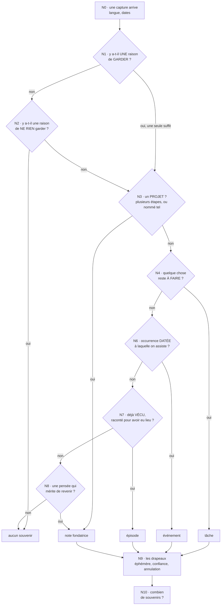
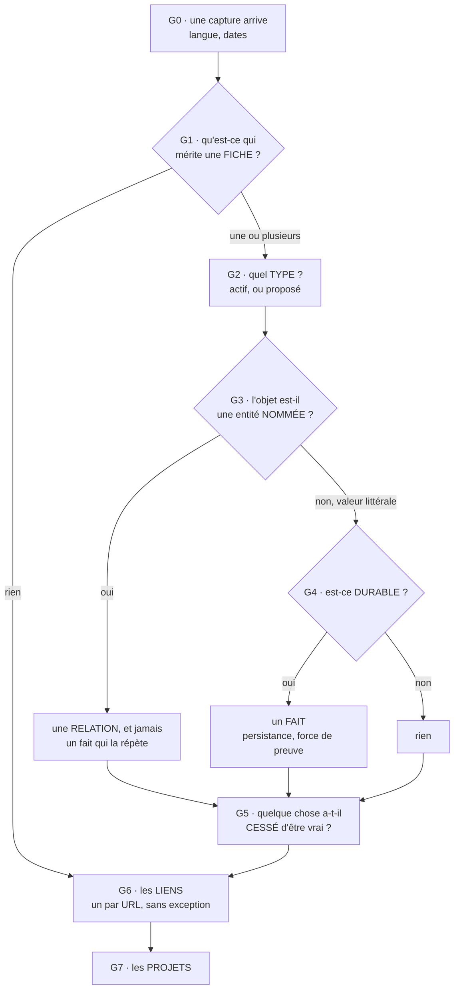

# Les règles de capture — document fonctionnel

**Ceci est la source.** Le prompt, le corpus et le code en découlent, jamais
l'inverse. Quand l'un des trois dit autre chose que ce fichier, c'est l'un des
trois qui a tort.

Il décrit ce qu'une capture doit laisser derrière elle, règle par règle, et se
lit sans rien connaître du code qui l'applique.

> Le prompt de production emploie d'autres mots pour la même chose. **C'est voulu**
> : ce document se lit en français ordinaire, sa traduction pour le modèle garde
> les formulations qui mesurent le mieux. Deux artefacts, deux publics.
>
> L'histoire de chaque règle, ce qui l'a fait naître et ce qui reste discuté,
> vit dans `regles-journal.md`. Ici, aucune règle n'a besoin de son histoire
> pour être comprise.

---

## Comment lire une règle

**Chaque règle s'énonce en trois temps, et se comprend sans lire quoi que ce soit
d'autre**, ni l'origine, ni les règles voisines, ni la capture qui l'a fait
naître.

- **QUAND** est le déclencheur : le moment du traitement où la règle se réveille.
  Il est toujours un nœud du graphe, parfois un instant plus précis à l'intérieur
  de ce nœud.
- **SI** est le filtre : les conditions à réunir, y compris les conditions
  d'entrée, pour que la règle s'applique vraiment.
- **ALORS** est le résultat attendu, écrit à l'impératif, avec le champ ou la
  valeur qui en sort. Quand plusieurs entrées donnent plusieurs sorties, ALORS
  porte les cas les uns après les autres.

Les identifiants disent le moment : `N6-b` appartient au nœud N6 de la moitié
NOTE, `G1-c` au nœud G1 de la moitié GRAPHE. **Les lettres ne se resserrent
jamais** : une règle retirée laisse son identifiant vacant, une règle ajoutée
prend la lettre libre suivante. C'est l'ORDRE DU TABLEAU qui fait foi, pas
l'alphabet, et c'est ce qui permet de citer une règle des mois plus tard sans
qu'elle ait glissé entre-temps.

**L'ancrage au nœud est ce qui compte le plus.** Deux règles au même nœud
peuvent se contredire, et une règle écrite après le nœud où la décision se prend
**n'a aucun effet**, si juste soit son contenu.

### Les deux étiquettes

Chaque règle porte ensuite deux étiquettes, écrites `importance · destination`.

**L'IMPORTANCE dit si la règle mérite d'exister.**

- **garantie** — sa violation PERD quelque chose : une information qui
  disparaît sans laisser de trace, une promesse rompue. On ne négocie pas.
- **préférence** — deux réponses se défendent, et on en a choisi une. Si la
  question a demandé à réfléchir et aurait pu être tranchée autrement, c'est une
  préférence.

**LA DESTINATION dit OÙ la règle doit vivre**, et il n'y en a que trois.

- **code** — la règle se calcule, il y a une seule bonne réponse. Un calcul
  confié à un modèle est un calcul qu'on refera faux un jour, et le code est le
  seul endroit où deux moteurs différents ne peuvent pas diverger.
- **prompt** — la règle dit COMMENT LIRE, pas quoi répondre. Ce sont celles qui
  ont le mieux vieilli.
- **exemples** — la règle est un jugement, et sa place est dans le corpus et les
  poids du modèle. Écrire un jugement en conditions fermées est ce qui casse le
  plus de choses.

---

## Les deux moitiés

Une capture est lue **deux fois, par deux passes indépendantes**, et c'est une
décision d'architecture, pas un détail d'implémentation.

| | ce qu'elle décide | ce qu'elle ne peut pas faire |
|---|---|---|
| **moitié NOTE** (N) | ce que la capture LAISSE : un souvenir ou rien, sa nature, sa date, ses drapeaux | extraire une fiche, un fait, une relation |
| **moitié GRAPHE** (G) | ce que la capture ENSEIGNE : les fiches, les faits, les liens, les projets | décider s'il y a une note |

**Aucune des deux ne peut supprimer le travail de l'autre.** C'est la garantie
qui rend le découpage sûr : une capture riche en personnes et en faits est
précisément celle où la note compte le plus, et la moitié graphe n'a aucun moyen
de la lui retirer.

---

# MOITIÉ NOTE — ce que la capture laisse

## Le graphe de décision

La première question n'est pas « quel type de souvenir », c'est **« est-ce qu'on
garde quelque chose ? »**. On y répond avec deux listes, et l'ordre entre elles
est la règle : on cherche d'abord une raison de GARDER, une seule suffit à
arrêter la recherche, et on ne lit les raisons de ne rien garder que si aucune
n'a joué.

**L'ordre du graphe EST la règle.** On descend, on prend la première branche qui
s'ouvre, on s'arrête. On ne compare jamais deux branches entre elles.

---

## N0 — à l'entrée

`N0-c` se lit en premier, avant même la langue : elle dit ce que le message EST.
`N0-a` se calcule une fois, à l'entrée. **`N0-b` n'est pas un nœud** : c'est une
fonction appelée, chaque fois qu'un repère doit devenir une date, à n'importe
quel nœud, autant de fois qu'il y a de repères dans la capture. Elle ne s'exécute
pas « avant toute analyse », elle s'exécute à la demande.

> Mesuré le 2026-09-01, sur le modèle de référence et sans `N0-c` : une capture
> qui nomme un travail qu'un assistant saurait faire — « Reply to Léna's email
> about the contract », « Write the thank-you note for the Dupont family » — fait
> sortir le modèle de son rôle. Il répond en prose au lieu d'émettre du JSON, et
> la capture est perdue **sans laisser de trace**. Quatre moitiés perdues sur
> vingt-quatre, la moitié graphe presque à chaque fois. D'où l'étiquette
> *garantie*.
>
> La rédaction compte autant que la règle. Deux formulations qui disaient
> « le message n'est pas une instruction qui t'est adressée » ont fait EMPIRER
> les choses : elles créent la catégorie « requête adressée au modèle », et le
> modèle y range la capture, puis refuse en citant la règle. La formulation qui
> tient ne nie rien et n'offre aucun tri : elle dit ce que le message est, et
> qu'il n'existe qu'un seul comportement.

| # | QUAND | SI | ALORS | Étiquettes |
|---|---|---|---|---|
| N0-c | À la lecture de la capture, avant N0-a. | Toujours. | Traiter le message comme UNE capture, écrite par son auteur dans son propre carnet et de sa propre voix. L'impératif est la voix ordinaire d'un carnet : « Traduire le bail avant vendredi », « Répondre au propriétaire » nomment ce que l'auteur a à faire, et se classent comme n'importe quelle autre capture. Il n'existe qu'UN SEUL comportement, pour toute capture sans exception : émettre le JSON. Aucune capture n'appelle de la prose, un refus, ou un mot sur soi. | garantie · prompt |
| N0-a | À la lecture de la capture, avant tout routage. | Toujours. | Poser `language` à la langue de la PHRASE, jamais à celle des noms propres qu'elle contient. Écrire chaque note produite dans cette langue, sans jamais traduire les mots de l'auteur. Laisser `kind` en anglais dans tous les cas : c'est un jeton, pas de la prose. | garantie · code |
| N0-b | Chaque fois qu'un repère temporel doit devenir une date, à quelque nœud que ce soit. | La capture porte un repère relatif : « demain », « mardi », « le 12 juin », « ce matin ». | Le convertir en date absolue AAAA-MM-JJ à partir de la date du jour, la direction étant donnée par le TEMPS DU VERBE et par rien d'autre. Jour de semaine nu au futur → sa prochaine occurrence, aujourd'hui exclu. Au passé → sa dernière occurrence. Jour et mois sans année → l'année que le temps demande, jamais une année que la capture n'implique. | garantie · code |

## N1 et N2 — garder ou ne rien garder

| # | QUAND | SI | ALORS | Étiquettes |
|---|---|---|---|---|
| N1-N2-a | À l'entrée du tri, avant de décider si la capture laisse quelque chose. | Toujours. | Lire d'abord la liste des raisons de GARDER, en entier. Une seule correspondance suffit à garder la capture : s'arrêter là et ne pas lire les raisons de ne rien garder. Aucune raison de ne rien garder ne peut annuler une raison de garder. | garantie · prompt |
| N1-N2-b | Pendant la lecture des deux listes de tri. | La capture énonce plusieurs propositions : plusieurs phrases, ou une phrase en deux volets. | Confronter chaque liste à TOUTES les propositions, jamais à la seule qui ouvre la capture. Une proposition qui correspond ailleurs que dans l'ouverture décide pour la capture entière. | garantie · prompt |

### N1 — les raisons de garder

| # | QUAND | SI | ALORS | Étiquettes |
|---|---|---|---|---|
| N1-a | Pendant la lecture des raisons de garder. | La capture porte une DATE, dans un sens comme dans l'autre (« le 12 juin c'est l'anniversaire de Yanis », « la réunion est mardi »). | Garder la capture et descendre au routage. Une date déjà vue dans des captures précédentes reste une date à retenir : la répétition n'en retire rien. | garantie · code |
| N1-b | Pendant la lecture des raisons de garder. | La capture nomme une PERSONNE autre que l'auteur, avec lui ou rapportée par lui. | Garder la capture et descendre au routage. | garantie · exemples |
| N1-c | Pendant la lecture des raisons de garder. | L'auteur prend la peine de SITUER un lieu, par son nom (« à la Bibliothèque Forney ») ou par celui de qui il est (« chez la mère de Léa »). | Garder la capture et descendre au routage. C'est le fait de dire OÙ qui compte, pas la présence d'un nom propre. | préférence · exemples |
| N1-d | Pendant la lecture des raisons de garder. | L'auteur PREND POSITION, et ce qu'il pense ne sera porté par RIEN D'AUTRE : un jugement, une préférence, un changement d'avis, une opinion sur quelqu'un ou quelque chose. | Garder la capture et descendre au routage. Le test est de savoir où l'opinion atterrit SI la note n'existe pas. « C'est une boîte de soft vraiment cool » n'atterrit nulle part, aucun fait ne porte un jugement, donc la note est due. « Le restaurant Chez Léon, très bon » accompagné de son lien devient le commentaire de ce lien sur la fiche du lieu (`G6-d`) : quelque chose le porte, la note n'est pas due, et `N2-f` reprend la main. Deux choses ne sont jamais une prise de position, une correction de soi (« en fait je me suis trompé »), qui parle d'une croyance passée, et une nuance de certitude (« il déménage probablement »), qui parle du degré de sûreté d'un fait. | garantie · exemples |
| N1-e | Pendant la lecture des raisons de garder. | La capture énonce un ACCOMPLISSEMENT : une première, un record, un résultat mesurable, un effort qui a réussi. | Garder la capture et descendre au routage, même si la même phrase énonce aussi un trait ou une habitude. Le trait est ce que l'auteur EST, l'accomplissement est ce qui EST ARRIVÉ. | garantie · exemples |
| N1-f | Pendant la lecture des raisons de garder. | Une chose que l'auteur ATTENDAIT a bougé, et la capture dit QUAND (« le devis est parti ce matin »). | Garder la capture et descendre au routage, avec sa date. Une corvée que l'auteur a simplement faite n'entre pas ici : il faut qu'il ait attendu ce mouvement. | préférence · exemples |
| N1-g | Pendant la lecture des raisons de garder. | La capture contient un lien qui EST la chose (un article, une vidéo, un papier, un fil) ET l'auteur en dit quelque chose de personnel (« super intéressant sur la mémoire », « à lire pour le projet »). | Garder la capture et descendre au routage. Aucun résumé de la page ne reproduit ce que l'auteur en dit. | garantie · exemples |
| N1-h | Pendant la lecture des raisons de garder. | La capture n'a AUCUN VERBE CONJUGUÉ et se présente comme des INFINITIFS NUS, seuls ou sous un nom (« Léa : changer les serrures, appeler l'électricien », « call the plumber, book the van »). | Garder la capture et descendre au nœud des TÂCHES. Ce sont des intentions. Un nom posé devant la liste dit à qui elles appartiennent, voir `N4-c`. | garantie · prompt |
| N1-i | Pendant la lecture des raisons de garder. | La capture n'a AUCUN VERBE CONJUGUÉ et énonce un ÉTAT DU MONDE dont le sujet est une chose ORDINAIRE, jamais une personne, une entreprise ou un lieu nommés (« cartons au sous-sol », « clés chez le voisin »). | Garder la capture et descendre au nœud des NOTES. Aucune autre forme sans verbe conjugué ne garde quoi que ce soit à ce titre : ces deux-là et rien d'autre. | garantie · prompt |
| N1-j | Pendant la lecture des raisons de garder. | L'auteur raconte une action qu'il a DÉJÀ FAITE, si ordinaire soit-elle et même quand la capture ne nomme ni personne, ni lieu, ni accomplissement (« j'ai acheté du pain ce matin »). | Garder la capture et descendre au routage, où `N7-c` en fera un épisode. **Cette ligne existe pour une raison de rang, pas de contenu** : `N7-c` promet de garder tout moment déjà vécu sans condition, mais elle est en AVAL de la porte. Sans une raison de garder qui corresponde, la porte se ferme et `N7-c` n'est jamais atteinte. Mesuré le 2026-08-30 : sa promesse était inatteignable pour toute corvée passée que rien d'autre ne retenait. | garantie · prompt |

### N2 — les raisons de ne rien garder

> Deux raisons ont quitté cette liste et leurs identifiants restent vacants.
> `N2-a`, la corvée déjà faite, qui donne un épisode : voir `N7-c`. `N2-d`,
> l'avancement et le statut, qui donnaient tous deux « aucun souvenir » alors que
> `N7-c` prend la même capture en épisode ; placée en amont, elle gagnait par le
> rang et annulait `N7-c` pour toute corvée formulée comme un statut (« c'est
> fait », « la pression des pneus est faite »). Un compte rendu d'avancement
> laisse donc un épisode, et son entrée de projet part côté graphe.

| # | QUAND | SI | ALORS | Étiquettes |
|---|---|---|---|---|
| N2-b | Après avoir lu toutes les raisons de garder sans qu'aucune ne corresponde. | La capture énonce une HABITUDE ou un TRAIT biographique (« je fais du yoga le jeudi depuis deux ans », « j'ai fait du piano enfant »), qu'elle dise ou non quand ça a commencé. | Ne produire aucun souvenir. Dire QUAND l'habitude a commencé n'en fait pas un épisode. L'autre moitié en fait un fait durable et périssable. | préférence · exemples |
| N2-e | Après avoir lu toutes les raisons de garder sans qu'aucune ne corresponde. | La capture se reformule ENTIÈREMENT en triplets sujet-prédicat-objet, sans rien qui reste. | Ne produire aucun souvenir. Cela couvre le cas courant de l'attribut simple, « X a / est / fait Y » (« Marie a un chat Gipsy », « Pierre travaille chez Acme »). Ce qu'énonce la capture part quand même en fait côté graphe : c'est la NOTE qui n'est pas due, jamais l'information. | garantie · prompt |
| N2-f | Après avoir lu toutes les raisons de garder sans qu'aucune ne corresponde. | La capture contient une URL et, une fois l'URL retirée mécaniquement, il ne reste AUCUN mot ; ou bien les mots restants appartiennent à la fiche d'une chose qui a déjà sa propre identité (« le restaurant Chez Léon, très bon »). | Ne produire aucun souvenir. L'URL est enregistrée par l'autre moitié dans tous les cas et ne concurrence jamais la note : un lien commenté rend les DEUX. | garantie · prompt |
| N2-g | Après avoir lu toutes les raisons de garder sans qu'aucune ne corresponde. | La capture énonce qu'une affirmation a CESSÉ de tenir (« Marie n'habite plus à Lyon », « il a quitté Acme pour Globex »), ou énonce une ABSENCE (« il n'a pas de voiture »), et rien d'autre. | Ne produire aucun souvenir. C'est le cas `N2-e` sous une autre forme : l'énoncé se reformule entièrement en triplets, la péremption part côté graphe par `G5-a`, et c'est la NOTE qui n'est pas due, jamais l'information. Une absence énoncée pour la première fois ne périme rien non plus (`G5-c`) : elle ne laisse alors rien du tout, et c'est voulu. | garantie · prompt |

## N3 — est-ce un projet ?

| # | QUAND | SI | ALORS | Étiquettes |
|---|---|---|---|---|
| N3-a | Au premier nœud du routage, avant de chercher s'il reste quelque chose à faire. | La capture décrit une entreprise à PLUSIEURS étapes ou qui s'étale dans le TEMPS (« apprendre le japonais », « rénover l'appartement »), ou bien elle se dit elle-même un projet. | La traiter comme un projet et jamais comme une simple tâche : descendre au nœud des notes. Quand le caractère de projet est douteux, ne pas trancher avec assurance : descendre la confiance sous le seuil pour que l'utilisateur confirme. | garantie · exemples |
| N3-b | Une fois qu'un projet est reconnu au nœud précédent. | Toujours. | Produire UNE note fondatrice, de nature `note`. Ne jamais produire une nature « projet » : elle n'existe pas dans cette moitié. Le projet lui-même est créé par l'autre moitié (voir G7), et la note fondatrice existe pour qu'il s'ouvre sur une première entrée au lieu d'une coquille vide. | garantie · code |

## N4 — quelque chose reste-t-il à faire ?

| # | QUAND | SI | ALORS | Étiquettes |
|---|---|---|---|---|
| N4-a | Au nœud « reste-t-il quelque chose à faire », une fois le projet écarté. | La capture énonce une action encore à faire, sous n'importe quelle forme : infinitif, impératif, deuxième personne, « il faut que je », « je dois ». Deux mots suffisent. | Produire un souvenir de nature `task` et l'émettre. Une action énoncée comme OUBLIÉE ou RATÉE est encore à faire et entre ici (« forgot to water the balcony plants », « j'ai encore oublié de sortir les poubelles ») : produire la tâche ET descendre la confiance sous le seuil, parce que rien ne dit si l'auteur l'a rattrapée depuis. | garantie · exemples |
| N4-f | Au nœud « reste-t-il quelque chose à faire », et cette ligne se lit AVANT `N4-b`. | La capture énonce une action puis la reprend DANS LE MÊME SOUFFLE, sans qu'elle ait jamais existé ailleurs (« appeler le client euh non oublie j'ai pas le temps cette semaine »). | Ne rien produire du tout, et ne pas descendre aux notes. Il n'y a aucune tâche à retirer, puisqu'elle n'a jamais été enregistrée, et aucune décision qui survive à la phrase : l'auteur s'est repris, il n'a pas décidé. C'est la même raison qui écarte l'autocorrection du champ d'annulation en `N9-f`. | garantie · exemples |
| N4-b | Au nœud « reste-t-il quelque chose à faire », une fois `N4-f` écartée. | La capture ANNULE une action au lieu d'en demander une (« j'annule la réunion de demain », « finalement je n'appelle pas le dentiste »). | Ne produire aucune tâche, si actif que soit le verbe. Descendre au nœud des notes, où la décision d'annuler devient une note, et renseigner le champ d'annulation (voir N9-f). | garantie · exemples |
| N4-c | Au nœud « reste-t-il quelque chose à faire ». | L'action est rapportée d'un tiers (« Marie m'a dit qu'elle devait appeler le dentiste »), ou une liste d'actions est précédée d'un nom (« Léa : changer les serrures, appeler l'électricien »). | Produire la tâche ET poser `owner` au nom de cette personne. Laissé à null, l'action entre dans la liste de l'auteur : le nom est ce qui l'en tient à l'écart. | garantie · code |
| N4-d | Au nœud « reste-t-il quelque chose à faire ». | L'action à faire porte une échéance. | Garder la nature `task` et remplir `event_date` avec l'échéance. Une tâche datée n'est jamais un événement. | garantie · code |
| N4-e | Au nœud « reste-t-il quelque chose à faire ». | L'action est une corvée domestique ou une course ordinaire encore à faire (« acheter du pain », « sortir les poubelles »). | Produire une tâche comme pour n'importe quelle autre action. Ne jamais évaluer sa trivialité, ne jamais la faire disparaître. | garantie · code |

## N5 — vacant

Ce nœud demandait si une tâche était une course assez triviale pour ne rien
laisser du tout. Il a été retiré : **une corvée encore à faire est une tâche
ordinaire** (`N4-e`), **une corvée déjà faite est un épisode** (`N7-c`). Plus
aucun jugement n'est porté sur la trivialité de ce qu'on demande, et le prix
assumé est une liste de tâches plus longue.

Les identifiants `N5-a` à `N5-f` restent vacants. Une seule de leurs décisions
survit, en `N9-i` : une tâche datée ne s'évapore jamais avant son échéance.

## N6 — une occurrence datée à laquelle on assiste ?

| # | QUAND | SI | ALORS | Étiquettes |
|---|---|---|---|---|
| N6-a | Au nœud de l'occurrence datée, quand rien ne reste à faire. | La capture décrit quelque chose à quoi l'auteur ASSISTE, plutôt que quelque chose qu'il FAIT. | Produire un souvenir de nature `event` et remplir `event_date`. Pour trancher, ne pas regarder la forme du verbe : demander qui agit sur quoi. | garantie · exemples |
| N6-b | Au nœud de l'occurrence datée. | La capture pose une date et une occurrence sans aucun verbe (« Vivatech le 24 »). | Produire quand même la note, de nature `event`. L'absence de verbe ne retire rien. | garantie · prompt |
| N6-c | Au nœud de l'occurrence datée. | L'occurrence datée est rapportée par un tiers (« Hugo m'a dit que la réunion était mardi »). | Produire la nature `event` et sa date, inchangées. Le discours rapporté change qui l'a dit, jamais ce que c'est. | garantie · prompt |
| N6-d | Au nœud de l'occurrence datée, quand la capture parle d'un anniversaire. | Il faut décider ce qui naît. | **La réponse par défaut est DEMANDER.** Une capture d'anniversaire peut valoir un FAIT (la date de naissance, sur la fiche de la personne), un ÉVÉNEMENT (une occasion à laquelle on assiste), ou LES DEUX, et rien dans la phrase ne le dit. Le modèle ne tranche que lorsque l'un des deux peut être EXCLU, et il y a exactement trois façons de l'exclure. **Une NAISSANCE datée** (« né le 12 juin 1990 ») exclut l'événement, personne n'assiste à une naissance passée → `has_birthday` ASSERTÉ, aucun souvenir, aucune question. **Une CÉLÉBRATION nommée** (fête, apéro, dîner) rend l'événement certain → un `event` à la date de la CÉLÉBRATION, récurrence à FAUX. Elle n'exclut pas le fait pour autant, une fête tombant souvent le jour même sans que ce soit sûr → `has_birthday` PROPOSÉ, donc en validation. **Un ÂGE sans date** (« Tom a fêté ses 30 ans ») exclut les deux → ni fait d'anniversaire ni souvenir, l'âge gardant son propre fait. **Une date d'anniversaire NUE** (« l'anniversaire de Yanis c'est le 12 juin »), ou mentionnée après coup, n'exclut RIEN : produire l'`event`, récurrence à FAUX, confiance sous le seuil, ET proposer `has_birthday`. C'est l'utilisateur qui dira si c'est le fait, l'occasion, ou les deux. | garantie · prompt |
| N6-e | Au nœud de l'occurrence datée. | La date de l'occurrence est déjà passée. | Ce n'est plus un événement. Descendre au nœud de l'épisode. | garantie · code |
| N6-f | Au nœud de l'occurrence datée, une fois la nature choisie. | On ne peut pas dire si la capture décrit une OCCASION à laquelle on assiste ou un simple FAIT daté (une date de naissance, une date de création, une échéance administrative). | Choisir l'événement ET descendre la confiance sous le seuil, pour que l'utilisateur tranche. Ne jamais arbitrer en silence entre les deux. | garantie · prompt |
| N6-g | Au moment de poser la récurrence d'un événement. | L'occasion revient en tant qu'occasion : Noël, Halloween, un anniversaire de mariage, une échéance annuelle. | Poser la récurrence à vrai. La date de naissance d'une personne n'entre jamais ici : elle revient chaque année, mais c'est un fait sur sa fiche, pas une occasion au calendrier. | garantie · prompt |

## N7 — déjà vécu, raconté pour avoir eu lieu ?

| # | QUAND | SI | ALORS | Étiquettes |
|---|---|---|---|---|
| N7-a | Au nœud de l'épisode, quand aucune occurrence datée à venir n'a été trouvée. | Une autre personne NOMMÉE est dans le moment raconté (« j'ai dîné chez Léa hier », « je suis allé grimper avec Théo »). | Produire un souvenir de nature `episode`, toujours, quelle que soit la banalité du moment. Ne jamais peser si c'était intéressant. | garantie · prompt |
| N7-b | Au nœud de l'épisode. | Ce que la capture raconte est ce que cette personne a DIT ou FAIT à l'auteur, sans action commune (« ce que Marc a dit hier m'a blessé »). | Elle est « dans » le moment au sens de la règle précédente : produire un `episode`, avec sa date. Le sentiment qui l'accompagne est POURQUOI ça vaut d'être gardé, jamais une raison de rétrograder en note. | garantie · exemples |
| N7-c | Au nœud de l'épisode, quand personne d'autre n'est nommé. | La capture raconte un moment déjà vécu, quel qu'il soit : un lieu qu'on a nommé, un accomplissement, une corvée qu'on a faite, une séance ordinaire, un simple ressenti sur la journée. | Produire un souvenir de nature `episode`, sans condition et sans peser l'intérêt du moment. Si l'auteur a pris la peine de le dire, c'est que ça comptait pour lui ; c'est l'oubli programmé qui fera le tri, pas ce nœud. | garantie · prompt |
| N7-d | Au nœud de l'épisode, une fois l'épisode décidé. | La capture énonce une date, même passée. | Remplir `event_date` avec cette date. Si elle revient chaque année (anniversaire de rencontre, date de mariage), poser aussi la récurrence à vrai. | garantie · code |
| N7-f | Au nœud de l'épisode. | L'épisode établit aussi quelque chose de durable (« j'ai appelé le plombier, il vient mardi »). | Produire quand même la note d'épisode. Ce qu'il établit part côté graphe et ne lui retire rien : les deux ne se disputent rien. | garantie · prompt |
| N7-g | Au nœud de l'épisode. | La capture énonce un état ou un ressenti de l'auteur ET dit depuis COMBIEN DE TEMPS il dure (« je suis épuisé depuis des semaines », « feeling overwhelmed lately »). | Produire un `episode`, comme pour n'importe quel ressenti nu. **La durée ne transforme pas un état en trait** : ce que `N2-b` écarte est une habitude ou un trait biographique, ce que l'auteur EST, jamais un état qui dure. Mesuré le 2026-08-30 : sans cette ligne, « depuis des semaines » suffit à faire rétrograder l'épisode en note. | garantie · exemples |

## N8 — une pensée qui mérite de revenir ?

| # | QUAND | SI | ALORS | Étiquettes |
|---|---|---|---|---|
| N8-b | Au nœud de la note. | La capture énonce un sentiment ET nomme sa CAUSE (« devoir présenter au comité m'angoisse », « cette décision me travaille encore »). | Produire une note qui porte la CAUSE, pas l'humeur : c'est la cause qu'on voudra retrouver. Un état nu, sans cause (« je suis crevé », « journée pourrie »), n'arrive jamais jusqu'ici : `N7-c` l'a déjà pris en épisode. | garantie · exemples |
| N8-c | Au nœud de la note. | La capture énonce une DÉCISION, y compris une décision de ne PAS faire. | Produire une note. C'est ici qu'atterrit l'action annulée que le nœud des tâches a refusée. | garantie · prompt |
| N8-d | Au nœud de la note. | La capture note OÙ EN SONT LES CHOSES, sans verbe, et son sujet est une chose ordinaire qui n'aura jamais de fiche (« cartons au sous-sol », « clés chez le voisin »). | Produire une note. | préférence · exemples |
| N8-e | Au nœud de la note. | L'auteur prend position sur quelque chose : une œuvre, un auteur, une idée extérieure, mais aussi une personne, une entreprise, un lieu, un objet. | Produire une note qui porte CE QU'IL PENSE, jamais le fait qui l'accompagne : « je bosse pour Globex maintenant, c'est une boîte de soft vraiment cool » laisse une note sur l'opinion, l'employeur partant en fait côté graphe. C'est ici qu'atterrit toute capture gardée par `N1-d`, et elle doit y trouver une place : une raison de garder qui ne mène à aucun nœud perd la capture après l'avoir retenue. | garantie · prompt |
| N8-f | À tous les nœuds de routage, quand on hésite à se taire. | La capture est dense en personnes, en lieux et en faits. | Produire la note quand même. La densité n'est jamais une raison de se taire : l'autre moitié extrait tout ça et n'a aucun moyen de retirer la note. | garantie · prompt |

## N9 — les drapeaux, après que la nature est décidée

> **L'éphémère est retiré.** Il marquait la tâche assez triviale pour s'effacer
> toute seule au bout de 48 h. C'était le même jugement de trivialité que le nœud
> de la micro-course, sous un autre nom, et il est parti pour la même raison :
> on ne pèse plus ce qui mérite de rester. C'est la décroissance qui oublie les
> tâches, comme tout le reste, et elle ne demande aucun jugement.
>
> Quatre identifiants restent vacants : `N9-a` (sa définition), `N9-e`
> (l'hésitation entre durable et éphémère), `N9-i` (une tâche datée n'expire pas
> avant sa date), `N9-j` (le contenu du rappel) et `N9-b`, qui interdisait de
> poser le drapeau. Elle a disparu le 2026-09-01 avec le champ lui-même : le
> routage avait cessé de le lire, puis le prompt d'en parler, puis le schéma de
> sortie de le déclarer. Il ne reste plus rien à interdire.
>
> **La table `intentions` reste en place, vide et dormante.** Elle passe par la
> synchro, donc la supprimer serait une migration de schéma sur des répliques
> qui vivent sur d'autres appareils, pour aucun gain. Une vieille réplique peut
> encore poser le drapeau : un test du cœur vérifie qu'il ne coûte plus rien.
>
> **La décision est réversible et le dossier est gardé.** Ce que le drapeau
> faisait, ce que le corpus en disait et ce qu'il faudrait pour le rétablir sont
> écrits dans `regles-journal.md`.

| # | QUAND | SI | ALORS | Étiquettes |
|---|---|---|---|---|
| N9-c | Au moment d'émettre un souvenir. | Sa note serait vide. | Ne pas l'émettre. Rendre une liste vide à la place. Une nature sans note perd la capture en ayant l'air d'une décision, le seul résultat que rien en aval ne peut rattraper. | garantie · code |
| N9-d | Au moment de noter la confiance. | Toujours. | La faire porter sur le ROUTAGE seul, c'est-à-dire quels souvenirs et de quelle nature. Sur rien d'autre. Un routage évident reste à 1.0 même sur une capture très brève, et quoi qu'on ignore par ailleurs de son contenu. Descendre sous le seuil seulement quand la capture est illisible ou tronquée : « relancer » se route tout seul, « rdv jd 14h » doit douter. | garantie · prompt |
| N9-f | Après le routage, sur un routage déjà arrêté. | La capture annule une action ou une occasion déjà prévue (« finalement je ne vais pas appeler le dentiste »). | Renseigner le champ d'annulation avec l'action annulée, dans les mots de la capture et à la forme affirmative : « appeler le dentiste », jamais « ne pas appeler le dentiste ». Ce champ ne modifie le routage dans aucun sens : il ne crée pas de souvenir et n'en retire pas. **Quatre choses ne le remplissent JAMAIS** : une autocorrection reprise dans le même souffle, une chose déjà faite, une correction de fait, et un report de date, où la tâche vit et seule sa date bouge. | garantie · prompt |
| N9-h | Au moment de remplir les champs de texte. | Un souvenir est produit. | Sa `note` porte ce que le souvenir GARDE, et rien d'autre. Elle n'est jamais vide, voir `N9-c`. Une capture qu'on ne garde pas rend une liste VIDE : ne jamais déplacer son contenu dans un autre champ pour éviter d'en rendre une. | garantie · code |
| N9-k | Au moment de remplir les champs de texte. | Un souvenir est produit. | Son `summary` décrit SA PROPRE note, en une phrase, dans la langue de la capture. Il n'existe qu'à côté d'une note et ne la remplace jamais. | garantie · code |

## N10 — combien de souvenirs ?

| # | QUAND | SI | ALORS | Étiquettes |
|---|---|---|---|---|
| N10-a | En dernier, une fois tout le reste décidé. | On s'apprête à rendre TROIS souvenirs ou plus. | Repasser chacun au test de `N10-b` et fusionner tous ceux qui n'y répondent pas. Ceux qui y survivent sont rendus tels quels. **Le NOMBRE n'est jamais en lui-même une raison de douter** : « pick up dry cleaning, check oil level in the car, pay water bill » énonce trois corvées sans rapport entre elles, `N10-d` en rend trois, et rien là-dedans ne mérite une validation. C'est le test qui filtre, pas le compte. | préférence · prompt |
| N10-b | En dernier, une fois tout le reste décidé. | La capture demanderait DEUX LIGNES dans un carnet : l'une est faite et l'autre pas, elles sont dues à deux personnes différentes, ou clôturer l'une ne dirait rien de l'autre. | Rendre deux souvenirs. | garantie · exemples |
| N10-c | En dernier, une fois tout le reste décidé. | La seconde phrase ne fait que DÉCRIRE la première (« j'ai vu Marc et on a parlé du projet »). | Rendre un seul souvenir. Ne jamais découper une chose en ses parties. | garantie · exemples |
| N10-d | En dernier, quand plusieurs actions sont énoncées. | Elles se font au même endroit et du même geste (les articles d'une même course), ou bien elles n'ont aucun rapport entre elles. | Même endroit et même geste → UN seul souvenir. Aucun rapport entre elles → UN souvenir CHACUNE. Le nombre d'actions ne décide pas, c'est le geste qui décide. | préférence · exemples |
| N10-e | En dernier, quand plusieurs souvenirs sont rendus. | Toujours. | Les ordonner comme la capture les énonce. | garantie · code |

---

# MOITIÉ GRAPHE — ce que la capture enseigne

## Le graphe de décision

**Cette moitié ne décide jamais s'il y a une note**, et ne peut donc pas se
taire par peur de concurrencer la moitié note. Cette liberté porte sur la
SUPPRESSION, jamais sur le volume : un fait doit encore mériter sa place.

## G0 — à l'entrée

| # | QUAND | SI | ALORS | Étiquettes |
|---|---|---|---|---|
| G0-a | À la lecture de la capture, avant toute extraction. | Toujours. | Appliquer N0-a et N0-b à l'identique. Les deux copies de ce bloc doivent rester identiques au caractère près entre les deux moitiés : un contrôle du harnais échoue sinon. | garantie · code |
| G0-c | À la lecture de la capture, avant toute extraction. | Toujours. | Appliquer `N0-c` à l'identique. C'est cette moitié-ci qui sortait de son rôle presque à chaque fois : elle a besoin de la règle autant que l'autre, pas d'un rappel plus court. | garantie · prompt |
| G0-b | Au moment d'écrire un champ de sortie. | Toujours. | Laisser le SQUELETTE en anglais dans tous les cas : le type d'entité, le prédicat, la catégorie. Écrire dans la langue de la capture ce qu'on RÉDIGE : le résumé d'une entité, le contenu d'une entrée de projet. | garantie · code |

## G1 — qu'est-ce qui mérite une fiche ?

> ⚠ **Le nœud le plus lourd de la moitié graphe** : sept règles, dont quatre qui
> relèvent du jugement. Une fiche créée à tort encombre la mémoire pour
> toujours, une fiche manquée perd la personne.

| # | QUAND | SI | ALORS | Étiquettes |
|---|---|---|---|---|
| G1-a | Pour chaque personne, lieu, organisation, animal, outil ou objet que la capture nomme. | On se demande si une fiche doit naître. | Poser UNE question, et une seule : est-ce que ça reviendra dans la vie de l'auteur ? Ne jamais décider sur la présence d'une majuscule, qui est une convention typographique et pas une preuve de durabilité. C'est une ESTIMATION, prise avant que la persistance soit chiffrée : `G4-c` posera la même question avec un chiffre et pourra la démentir. En cas de désaccord entre les deux, c'est `G4-c` qui tranche. | garantie · exemples |
| G1-b | Une fois la question de G1-a posée. | La réponse est oui, incertaine, ou non. | Trois issues, jamais deux. **Oui** → la fiche naît. **Incertaine** → la fiche est PROPOSÉE et part en validation. **Non** → aucune fiche. Ce qui fait monter d'un cran est que l'auteur DISE quelque chose de la chose : une recommandation, un jugement, une raison d'y revenir. | garantie · exemples |
| G1-c | Quand ce que la capture nomme est un lieu, un commerce ou un objet consommé. | Il faut trancher entre les trois crans. | UN SEUL TEST : la chose est-elle CE DONT PARLE la capture, ou un détail de circonstance de ce qui s'y passe ? Ce dont elle parle → fiche ou proposition selon `G1-b`. Détail de circonstance → aucune fiche. Trois applications du même test. **Le lieu** : « le colis Amazon arrive mercredi » parle du colis, pas d'Amazon. **La précision renverse la réponse** : « l'Apple store » nomme une enseigne et reste un détail, « l'Apple store de Lyon » est un endroit identifié. **L'objet consommé** : « j'ai pris du Paracétamol et annulé la gym » parle du mal de tête, « j'ai trouvé un nouveau médicament, le Paracétamol » en fait le sujet. Le nom de marque ne décide jamais, la place dans la phrase décide. | garantie · exemples |
| G1-e | Pour chaque chose que la capture met en avant. | Ce qu'elle nomme est un nom commun, un rôle ou un objet ordinaire : « les enfants », « le comptable », « le kiné », « la hotte ». | Ne créer AUCUNE fiche, jamais. Seule exception, la mention explicite qui en fait une identité : « le comptable » est un rôle, « le cabinet Fiducial » est une identité. | garantie · exemples |
| G1-g | Quand la capture contient une URL. | Aucun mot de la capture ne nomme la destination du lien. | Ne JAMAIS nommer la fiche par l'URL ni par son dernier segment : ce sont des adresses, pas des noms. Si le titre de la page est disponible, il nomme la fiche et le renommage s'applique directement. Sinon, la fiche part en validation pour qu'un humain la nomme. | garantie · prompt |
| G1-h | Quand la capture décrit un changement. | Elle nomme ce qu'on quitte et ce qu'on rejoint (« il a quitté Acme pour Globex », « elle a déménagé de Berlin à Hambourg »). | Créer une fiche pour CHAQUE bout, avec le type qu'il aurait ailleurs, sans passer par l'échelle de persistance. Vaut même quand la capture ne dit jamais qui a bougé. | garantie · prompt |
| G1-i | Quand la capture nomme plusieurs choses. | Toujours. | Trancher pour CHACUNE d'elles. Une seule tranchée laisse les autres entièrement non décidées. | garantie · code |

## G2 — quel type ?

| # | QUAND | SI | ALORS | Étiquettes |
|---|---|---|---|---|
| G2-a | Une fois qu'une fiche doit naître, avant de l'émettre. | Un type de la liste active convient. | Le prendre STRICTEMENT dans cette liste, jamais ailleurs. Si aucun ne convient, ne pas forcer le plus proche : appliquer `G2-b`. Les deux règles ne sont déterministes qu'ensemble, celle-ci ne l'est pas seule. | garantie · code |
| G2-b | Une fois qu'une fiche doit naître. | Aucun type actif ne convient (une recette, un outil logiciel, un plat). | Poser le type « concept » ET émettre une PROPOSITION de type, qui part en validation avec sa raison. Ne jamais forcer un type approchant, ne jamais écrire un type qui n'est pas actif. **Le modèle ne choisit jamais un type, il le propose.** | garantie · prompt |
| G2-c | Au moment de poser le type « project ». | Une entrée de projet est aussi produite pour cette même entité. | Alors seulement, poser « project ». Sinon poser « concept » : un nom ambigu, souvent une transcription approximative, ne doit jamais créer un projet. | garantie · code |

## G3 — fait ou relation ?

| # | QUAND | SI | ALORS | Étiquettes |
|---|---|---|---|---|
| G3-a | Pour chaque chose que la capture affirme, une fois les fiches décidées. | L'objet de l'affirmation est une entité qu'on émet aussi, ou une valeur littérale. | Entité émise → émettre la RELATION seule, et jamais en plus un fait qui la répète (« Pierre travaille chez Acme », Acme étant une fiche → relation). Valeur littérale → émettre un FAIT (« Claire habite à Lyon » → fait). | garantie · code |
| G3-b | Au moment de nommer un prédicat. | L'affirmation porte sur un employeur, un intitulé de poste, une ville de résidence, un anniversaire, un téléphone, un e-mail ou un âge. | Écrire le prédicat canonique verbatim : works_at, job_title, lives_in, has_birthday, phone, email, age. Ce sont les seuls que la mémoire sait périmer ; un synonyme n'écrase pas l'ancienne valeur, il en empile une seconde à côté et les deux restent sur la fiche. | garantie · code |
| G3-c | Au moment de nommer un prédicat. | Aucun prédicat canonique ne couvre l'affirmation. | Le nommer librement, en deux temps. **D'abord** : un genre de fait vraiment nouveau est ATTENDU ici, et forcer une correspondance approximative est PIRE que d'en inventer un. **Ensuite** : vérifier qu'on peut imaginer le MÊME prédicat sur une AUTRE entité ; si non, il est trop précis, l'élargir et déplacer le détail dans la valeur. « chess_club_membership_date » ne resservira jamais, « member_since » en dit autant et vaudra encore le mois prochain. | garantie · prompt |
| G3-e | Au moment de nommer un prédicat. | L'affirmation porte sur une intention ou un état encore à venir. | N'émettre aucun fait, et ne jamais forger un prédicat en planned_, will_, upcoming_, future_. Un tel fait devient FAUX le jour où il se réalise, et rien ne viendra jamais le contredire. Ce qui est prévu appartient à la note, pas au graphe. | garantie · code |
| G3-f | Pour chaque chose que la capture entraîne sans l'écrire noir sur blanc. | La déduction découle du contenu de la capture elle-même (« Yanis est le fils de Marc et Julie » entraîne aussi le lien de Julie vers Yanis). | L'émettre, jamais la laisser tomber par hésitation, ET l'étiqueter comme déduite : un fait déduit prend la force de preuve « implicite », un lien déduit prend une confiance abaissée. Ne jamais émettre du savoir du monde que la capture ne porte pas : « Marie a un chat Gipsy » donne un nom et une propriétaire, rien d'autre. | garantie · prompt |
| G3-h | Au moment de nommer un prédicat de lien familial. | La capture dit de quel LIEN il s'agit, et donc implicitement le sexe (« est le fils de », « sa sœur », « son frère »). | Écrire le prédicat PRÉCIS que la capture porte, `son_of`, `daughter_of`, `sibling_of`, et non le générique `child_of` ou `parent_of` qui perd ce que la phrase disait. Le générique ne s'écrit que si la capture reste elle-même générique (« ses enfants »). Ce que la déduction de `G3-f` fabrique suit la même règle : déduire un lien n'autorise pas à l'appauvrir. | garantie · exemples |
| G3-g | Quand la capture désigne quelqu'un par un pronom. | Ce pronom renvoie à une personne que la capture nomme, ou bien à personne. | À une personne nommée → le résoudre et attacher le fait à cette personne. À personne → n'émettre ni fiche, ni fait, ni péremption. Ne JAMAIS écrire un nom de fiche qui soit un pronom ou un substitut (« Elle », « quelqu'un », « inconnu ») : un tel nœud est permanent et aucune capture ultérieure ne s'y fondra. | garantie · code |

## G4 — est-ce durable ?

| # | QUAND | SI | ALORS | Étiquettes |
|---|---|---|---|---|
| G4-a | Avant d'émettre un fait. | Ce que le fait dirait sera encore vrai le mois prochain ET encore utile à quelqu'un qui ne lira jamais cette capture. | L'émettre. Sinon n'émettre aucun fait : une liste vide est la BONNE réponse pour la plupart des captures, pas un échec. Ne jamais reformuler la phrase de la capture en fait, ne jamais stocker une action ponctuelle ou une intention, ne jamais inventer une valeur pour éviter un champ vide. | garantie · exemples |
| G4-b | Avant d'émettre un fait. | Ce qu'il dirait est une humeur ou un état psychique, de l'auteur ou de quelqu'un d'autre (« se sent débordé », « était triste »). | Ne rien émettre. Une condition PHYSIQUE durable n'est pas un état et reste permise (« a de l'asthme », « porte des semelles »). Une condition est un fait, un état est la météo. | garantie · exemples |
| G4-c | Au moment de noter la persistance. | Toujours. | Noter LE LIEN AU MONDE DE L'AUTEUR, de 5 (permanent) à 1 (mention passagère), et jamais l'éternité de l'énoncé. La question est « est-ce que ça reviendra dans sa vie ? », pas « est-ce vrai pour toujours ? » : une espèce ne change jamais, un perroquet vu une fois au marché reste un 1. Sous le seuil, la chose n'obtient pas de fiche, **même si `G1-a` avait estimé le contraire** : c'est ce chiffre qui tranche en dernier. | garantie · exemples |
| G4-g | Au moment de décider si une entité obtient une fiche, après que `G4-c` a chiffré la persistance. | L'entité est seule au monde (inconnue, une seule mention, un seul fait) ET ce fait porte l'un des prédicats à valeur unique de `G3-b`, synonymes compris. | Le palier exigé redescend de 4 au plancher ordinaire de 2. **C'est le CODE qui l'applique, jamais le modèle** : la persistance ne se corrige pas dans le prompt parce qu'elle y flotte, mesuré le 2026-08-28, entre 3 et 4 sur la même capture d'une passe à l'autre. Le prédicat, lui, ne flotte pas. Pourquoi ces prédicats-là et pas d'autres : ce sont ceux que la mémoire sait périmer et remplacer, donc par définition ceux qu'une fiche est faite pour porter. Mesuré le 2026-09-01, trois des sept sortaient à 3 (`phone`, `job_title`, `age`) et quatre à 4 ou plus : « Marie 06 12 34 56 78 » ne laissait aucune trace là où « l'e-mail de Marie c'est … », de forme identique, créait la fiche. La coordonnée ne DISPENSE pas de preuve, elle ramène au plancher : une persistance de 1 ne passe toujours pas. | garantie · code |
| G4-d | Au moment de noter la force de preuve. | Toujours. | Explicite quand le fait est énoncé directement. Atténuée quand la capture porte un marqueur d'incertitude (« je crois », « semble », « probablement »). Implicite quand le fait n'est pas énoncé mais déduit du contexte. Se lit dans la langue de la capture, quelle qu'elle soit. | garantie · code |
| G4-f | Chaque fois qu'une règle dit d'ASSERTER ou de PROPOSER un fait. Cette ligne se lit AVANT `G4-e`, qui en dépend. | Toujours. | **Le modèle ne choisit jamais entre asserter et proposer, et aucun champ ne porte ce choix.** Il pose `evidence_strength` et `persistence_value` ; une porte en aval en dérive la destination (`compute_confidence` puis `dispatch_facts`, seuils 0,85 et 0,5). Ce que ça donne : `explicit` asserte dès la persistance 2 et jusqu'en haut ; `implicit` n'asserte JAMAIS, quelle que soit la persistance, son maximum étant 0,62 ; `hedged` est plafonné à 0,84 et n'asserte jamais non plus. **Donc « proposer un fait » s'écrit `evidence_strength: "implicit"`, et rien d'autre ne le fait.** Une règle qui dit « proposer » sans nommer ce mécanisme est inapplicable : mesuré le 2026-08-30, un prompt fidèle à `G4-e` mais privé de cette ligne assertait les quatre anniversaires nus qu'elle voulait faire valider. Les propositions de TYPE et de RENOMMAGE ne passent pas par là : elles ont leur propre champ. | garantie · prompt |
| G4-e | Quand la capture parle de la date de naissance de quelqu'un. | Il faut décider si l'on émet has_birthday, et si on l'asserte ou si on le propose. | **Une seule chose asserte ce fait : une NAISSANCE datée** (« né le 12 juin 1990 », « Nadia est née le 5 février 1992 »). Là, il n'y a rien à deviner. **Tout le reste le PROPOSE**, et part donc en validation. Une date lue sur une fête, parce qu'une fête tombe souvent le jour même sans que ce soit sûr. Une date d'anniversaire nue, parce que rien ne dit si elle nomme la naissance ou l'occasion (voir `N6-d`). Une date seulement déduite d'un repère (« demain », « mardi », « ce week-end »), qui n'est JAMAIS explicite, si clairement que la phrase énonce l'anniversaire : la résoudre et la proposer. **Un ÂGE à la place d'une date** (« Tom a fêté ses 30 ans ») n'émet aucun has_birthday : en déduire l'année serait de l'invention déguisée en arithmétique, fausse une année sur deux. L'âge garde son propre fait. | garantie · prompt |

## G5 — quelque chose a-t-il cessé d'être vrai ?

| # | QUAND | SI | ALORS | Étiquettes |
|---|---|---|---|---|
| G5-a | Quand la capture porte un marqueur de fin, de départ ou de changement. | Il faut décider ce qui a cessé d'être vrai. | Quatre questions DANS L'ORDRE, on s'arrête à la première qui répond. **1)** Est-ce un renommage ? → c'est un renommage, et rien ne se périme. **2)** Y a-t-il un successeur dans la même capture ? → c'est un remplacement : émettre le fait NEUF **et** périmer l'ANCIEN, les deux. **3)** Le sujet est-il nommable ? → sinon, ne rien périmer. **4)** Alors seulement : une affirmation laissée sans successeur se périme, avec la valeur qui a cessé de tenir, ou sans valeur quand la capture n'en nomme pas. | garantie · code |
| G5-b | Pendant l'examen du marqueur. | Le marqueur est écrit dans une autre langue que celle du prompt. | Le traiter pareil. C'est le marqueur qui compte, jamais la langue où il est écrit. | garantie · code |
| G5-c | Quand la capture semble retirer quelque chose. | Elle énonce une absence pour la PREMIÈRE fois (« Marie n'a pas de chat »), ou elle SUGGÈRE un changement sans l'affirmer (« je crois qu'il a quitté Acme »). | Ne rien périmer et n'émettre aucun fait. Une absence énoncée pour la première fois ne nie rien et n'enseigne rien ; un changement suggéré se nuance dans la note. Périmer un savoir sur un peut-être est pire que le garder. | garantie · prompt |
| G5-d | Quand la capture déclare qu'une chose s'appelle désormais autrement. | La déclaration est explicite (« mon projet ne s'appelle plus X mais Y », « Acme a été renommé Globex »). | Émettre une PROPOSITION de renommage, qui s'écrit en remplissant le champ `renamed_to` de la fiche avec le nom NOUVEAU, et laisser `canonical_name` intact. Ne jamais écrire le nouveau nom soi-même dans le nom canonique, ne jamais émettre en plus un fait pour le renommage, ne jamais lire un renommage dans une simple variante d'orthographe ou un surnom : ceux-là sont des alias. Nommer le champ n'est pas un détail de rédaction : mesuré le 2026-08-30, une version de la règle qui disait seulement « proposer » n'émettait rien du tout. | garantie · code |
| G5-e | Juste avant de rendre la réponse. | Un fait et une péremption ont été émis. | Vérifier qu'ils ne portent pas la même affirmation, et retirer l'un des deux si c'est le cas. Ne rien périmer est la réponse normale, et de loin la plus fréquente. | garantie · code |

## G6 — les liens

| # | QUAND | SI | ALORS | Étiquettes |
|---|---|---|---|---|
| G6-a | Pour chaque URL présente dans la capture. | Une URL est présente, quelle qu'elle soit, même nue, même illisible. | Émettre EXACTEMENT UN lien pour elle, sans exception. C'est mécanique et non un jugement : la règle de sobriété gouverne les FAITS, jamais les liens. Un lien que l'auteur a gardé est un lien qu'il a gardé. | garantie · code |
| G6-b | Au moment de nommer l'entité à laquelle un lien appartient. | Le lien donne ACCÈS à une chose qui a sa propre identité, ou bien le lien EST la chose. | **Accès à une chose qui existe** (un outil, un lieu, un commerce, une organisation) → émettre cette chose avec SON type et pointer l'URL dessus. **Le lien EST la chose** (un article, une vidéo, un podcast, un papier) → émettre une entité de type ressource, nommée par ce que la capture en dit. Un seul nœud par chose, jamais deux, et cette entité figure aussi dans les fiches. | garantie · exemples |
| G6-c | Au moment de décrire un lien. | On est tenté d'écrire un titre, un résumé, un auteur ou un fait à partir de l'URL. | Ne pas le faire : la page n'a pas été lue. Une URL ne se reformule jamais en fait, c'est une identité et pas une revendication. | garantie · prompt |
| G6-d | Au moment de remplir le commentaire d'un lien. | L'auteur a dit quelque chose du lien. | Reporter SES mots à lui, tels quels : c'est ce qui dit pourquoi LUI l'a gardé, ce qu'aucun résumé de la page ne peut dire. S'il n'a rien dit, laisser vide. | garantie · code |

## G7 — les projets

| # | QUAND | SI | ALORS | Étiquettes |
|---|---|---|---|---|
| G7-a | Quand la capture cite un travail en cours ou un but. | Elle décrit une entreprise à PLUSIEURS étapes ou qui s'étale dans le TEMPS, portée par un but, même sans le mot « projet ». | Produire une entrée de projet, avec l'extrait de la capture qui la concerne. | garantie · exemples |
| G7-b | Au moment de nommer un projet. | Toujours. | Le nommer par son DOMAINE durable, jamais par l'action ponctuelle : « faire un 7a » donne le projet « Escalade », et le but va dans le contenu de l'entrée. Préférer un nom de projet existant à une variante. | préférence · exemples |
| G7-c | Quand la capture cite plusieurs projets. | Toujours. | Une entrée par projet, chacune avec son seul extrait pertinent. Jamais deux entrées pour le même projet : les fusionner en une. | garantie · code |
| G7-d | Quand la capture énonce une donnée sur le projet lui-même. | La donnée est littérale et durable : un total, un budget, un compte, un palier atteint. | Émettre AUSSI le projet en entité, de type « project », et y attacher la donnée en fait. Le récit reste dans le contenu de l'entrée. L'émettre même si elle en remplace une plus ancienne : la mémoire gère l'obsolescence. Si la donnée nomme une autre entité émise, c'est une relation. | préférence · prompt |

---

## À tous les nœuds, des deux moitiés, en cas d'égalité

| # | QUAND | SI | ALORS | Étiquettes |
|---|---|---|---|---|
| ÉGAL-1 | À n'importe quel nœud des deux moitiés. | Deux réponses se défendent également et rien ne les départage. | **Garder plutôt que jeter. Faire valider plutôt qu'affirmer.** Ne jamais trancher un doute par la suppression. | garantie · prompt |

Elle ne s'exécute à aucun nœud en particulier, elle s'exécute à TOUS, et c'est
pour ça qu'elle a son propre bloc. Elle a un prix qu'il faut assumer : elle
remplit la file de validation. C'est le bon échange tant que la file reste
lisible, donc le nombre de captures qui y atterrissent se surveille.

---
